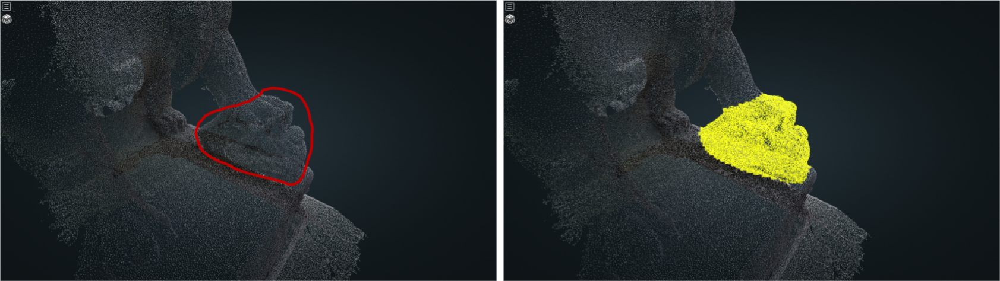
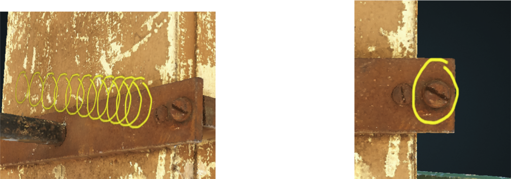
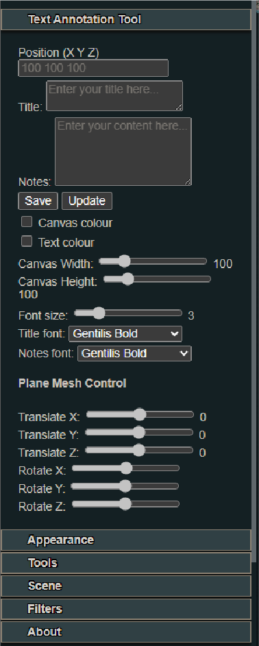
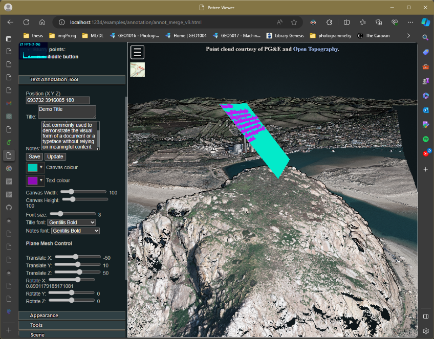
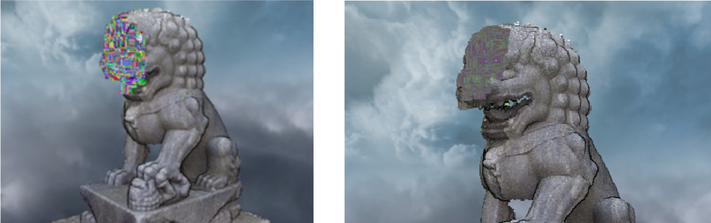

### GEO1101-2023 Group 4 - Pointcloud based anatomy

___

In this project, we implemented:

- the selection tool;
- the annotation tool;
- the anonymization tool.

All the above functions are developed under [Potree v1.7](https://github.com/potree/potree/tree/1.7/) framework and [Three.js](https://threejs.org/).

1. Selection tool

   The selection tool consists of three parts, Lasso selection, Layers control system, and Data export.

   

   

   

2. Annotation tool

   This tool enabled the note-taking and annotation function in Potree.

   

   

   

1. Anonymization tool

   

##### Get start

___

Just download or fork this repository, and put the whole folder into a web server, the above additional tools will be automatically enabled in the Potree v1.7.

##### Replace point cloud data

___

The detail part will be update soon.